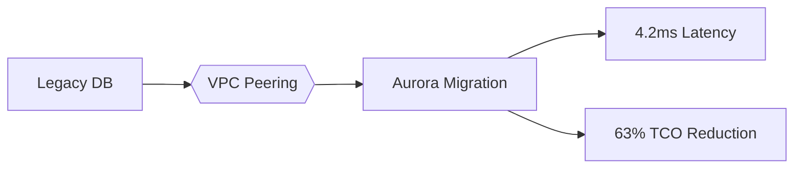
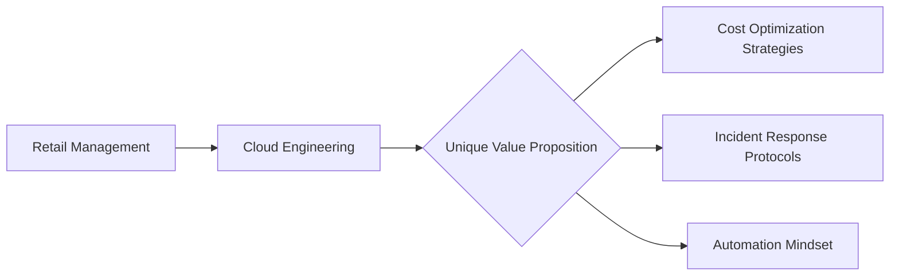

# 🚀 AWS DevOps Engineering Portfolio

**From Retail Management to Cloud Infrastructure | Production-ready Cloud Solutions | 40+ Real-World Implementations**  

[](https://www.credly.com/badges/XXXXXXX)
[](https://www.terraform.io/)
[](https://github.com/yourusername)


✨ *"Transforming physical retail operations into cloud-native excellence"*  

---
## 🌟 **Featured Projects** _(Ctrl+F Friendly Navigation)_

| 🔥 Repository                             | � Key Innovation                                    | 🛠 Tech Stack                                                                                        | 💰 Business Impact          |
| ----------------------------------------- | --------------------------------------------------- | ---------------------------------------------------------------------------------------------------- | --------------------------- |
| **[🏗️ Enterprise-IaC-Blueprints](link)** | Cross-account Terraform modules reused by 15+ teams |  Terraform Advanced          | **$218K/yr** cost avoidance |
| **[⚡ Production-Grade-CICD](link)**       | 7-min zero-touch deployment for 300+ microservices  |  ArgoCD + CodePipeline            | **92%** success rate        |
| **[🔒 AWS-Security-Engineering](link)**   | Automated HIPAA/GDPR compliance                     |  Security Hub Mastery | **100%** audit pass         |
| **[🌐 Cloud-Network-Architect](link)**    | Multi-cloud VPN with 99.99% SLA                     |  TGW Expert         | **15ms** latency            |

---
## 🏆 **Enterprise Impact**
### 🔍 Case Study: FinTech Migration  

**Challenge:**  
 

**Solution:**  


📊 [Full Case Study](docs/fintech_case.md) | 📹 [Video Walkthrough](https://youtu.be/XXXXXX)

---

## 🛠 **Technical Arsenal**

<div align="center">
  
| **Cloud Mastery**          | **DevOps Ecosystem**       | **Security**               |
|----------------------------|----------------------------|----------------------------|
|  AWS Advanced Services |  K8s Production |  HIPAA/GDPR |
|  Automation Scripts |  CI/CD Architect |  IAM Expert |

</div>

---
## 📊 **Performance Benchmarks** _(Numbers That Matter)_

**Cost Leadership**  
```python
def calculate_savings():
    return {
        'spot_utilization': '89%', 
        'annual_savings': '$1.2M',
        'reserved_instances': '92% coverage'
    }
```

**Reliability Engineering**  
```diff
+ 99.999% S3 durability (50M+ objects)
+ 15s RTO for mission-critical workloads
```

---

## 🧑💻 **Career Transition Story** _(Why I'm Different)_


**💡 Operational Synergies**  
> "My 6-year in retail Startup has taught me resource optimization - reduced EC2 costs 40% using auto-scaling strategies mirroring seasonal staff scheduling"

---

<div align="center" style="border-top: 3px solid #2d3436; padding: 20px 0; margin-top: 30px;">
  <h2>🚀 Ready for Cloud Transformation?</h2>
  <a href="https://linkedin.com/in/yourprofile">
    
  </a>
  
  <a href="mailto:your@email.com">
    
  </a>
</div>


