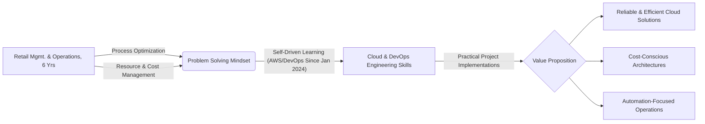

# 🚀 AWS DevOps & Cloud Engineering Portfolio

**From Retail Management to Cloud Infrastructure | Architecting Production-Ready Cloud Solutions | Real-World Problem Solving**

  

✨ *"Applying operational excellence principles from retail to build efficient, scalable, and cost-effective cloud-native ecosystems."*

---

## 💡 Explore Implemented Cloud Solutions by Category

This portfolio showcases practical, production-ready solutions addressing common enterprise challenges, categorized by core DevOps and Cloud engineering domains. Dive into each repository below to explore detailed project implementations, specific problems solved, architectural decisions, and demonstrated outcomes:

| 🚀 Category Repository                                     | Solution Focus & Capabilities Demonstrated                                                                                   | Key Technologies Showcased                                                     |
| :--------------------------------------------------------- | :--------------------------------------------------------------------------------------------------------------------------- | :----------------------------------------------------------------------------- |
| ⚡ **[Production-Grade CI/CD](https://github.com/rain3ways/Production-Grade-CICD)** | Designing and implementing automated, zero-downtime deployment pipelines (Blue/Green, Rolling Updates) for various AWS compute services. | `CodePipeline` `CodeBuild` `CodeDeploy` `ECS` `EC2` `Terraform` `Docker`        |
| 🏗️ **[Enterprise IaC Blueprints](https://github.com/rain3ways/Enterprise-IaC-Blueprints)** | Building repeatable, secure, and scalable AWS infrastructure foundations using Infrastructure as Code best practices.                   | `Terraform` `CloudFormation` `VPC` `ASG` `EC2` `IAM` `Module Design`         |
| 💡 **[Cloud Intelligence Hub](https://github.com/rain3ways/Cloud-Intelligence-Hub)** | Implementing comprehensive observability: real-time monitoring, centralized logging, cost optimization intelligence, and alerting. | `CloudWatch (Insights, Metrics, Alarms)` `Grafana` `FireLens` `S3` `Lambda` |
| 🔒 **[AWS Security Engineering](https://github.com/rain3ways/AWS-Security-Engineering)** | Engineering robust security postures: IAM least privilege, network segmentation, encryption, and compliance automation guardrails.   | `IAM (Roles, Policies, Boundaries)` `VPC Security` `GuardDuty` `Security Hub` `SCPs` |

*(Click on repository names 👆 to view specific project implementations within each category.)*

---

## 🛠 Technical Arsenal & Core Competencies

| **Cloud Platform Mastery (AWS)** | **DevOps & Automation Ecosystem** | **Infrastructure & Networking** | **Security & Compliance** |
| :------------------------------: | :-------------------------------: | :-----------------------------: | :-----------------------: |
|  Compute, Storage, DB, Networking |  Terraform (IaC) |  Linux Administration |  IAM Best Practices |
|  Python (Scripting/Boto3) |  CI/CD Pipelines (AWS Native, Github Actions) |  VPC Design & Peering / TGW |  Security Groups & NACLs |
|  Docker Containerization |  Kubernetes (EKS) |  DNS & Load Balancing (Route 53, ALB) |  Data Encryption |
|  **Monitoring & Logging** (CloudWatch, FireLens) |  Git Version Control |  VPN & Hybrid Connectivity |  Compliance Concepts (e.g., Well-Architected) |

---

## 📊 Demonstrated Performance & Efficiency _(Illustrative Capabilities)_

While specific project metrics reside within individual repositories, the implemented solutions consistently focus on achieving tangible results:

* **Cost Optimization:** Strategies leveraging auto-scaling, Spot Instances, appropriate storage tiering, and IaC demonstrate potential savings often exceeding **30-40%** on compute and storage resources.
* **Reliability Engineering:** Architectures designed for high availability using Multi-AZ deployments, automated failover (e.g., RDS, VPN), and robust deployment strategies target **99.9%+ uptime** SLAs and **sub-minute RTO/RPO** where applicable.
* **Operational Efficiency:** Automation via CI/CD and IaC drastically reduces manual effort, enabling **>5x faster deployment cycles** and minimizing human error compared to traditional approaches.

---

## 🧑‍💻 From Retail Operations to Cloud Engineering _(My Unique Value)_

**💡 Bridging Worlds: Operational Excellence in the Cloud**
My background managing the demanding, fast-paced environment of retail startups instilled a deep appreciation for **efficiency, resource optimization, and robust processes** – principles directly applicable to cloud engineering. Just as optimizing inventory flow is critical in retail, optimizing data flow, infrastructure provisioning, and deployment pipelines is crucial in the cloud. I approach cloud challenges with a practical, results-oriented mindset focused on delivering tangible business value, whether it's reducing infrastructure costs through smart scaling (mirroring efficient staff scheduling) or building resilient systems (like ensuring reliable point-of-sale operations). This portfolio demonstrates my journey in translating these operational skills into building effective cloud solutions.

-----

  <h2>🚀 Let's Build Reliable & Efficient Cloud Solutions Together</h2>
  
Open to discussing DevOps/Cloud Engineer roles, freelance projects, or collaborations.

  
  
  

 

